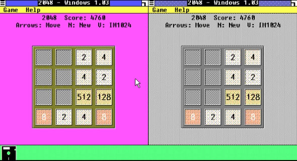
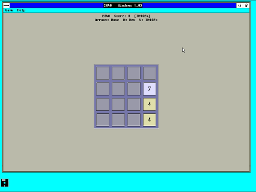
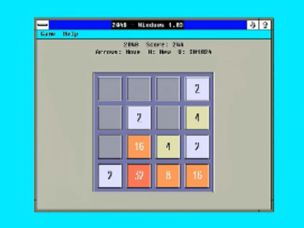
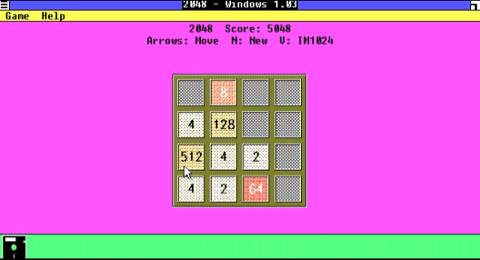
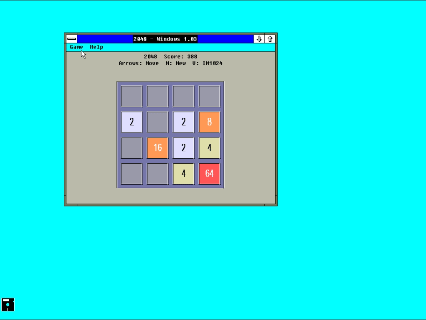
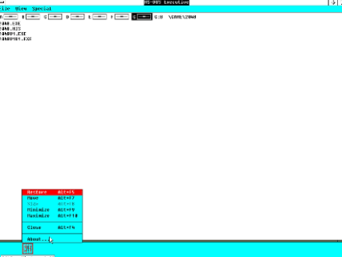

# 🧩 2048 for Windows 1.03
一款复古移植数字小游戏，为古老 Windows 1.03 系统打造✨

## 🖥 运行平台
原生适配 Windows 1.03，兼容 Win2.x；Win3及以上需开启兼容模式，Win10/11 可搭配 [OTVDM](https://github.com/otya128/winevdm) 兼容层运行。

## 🎮 游戏玩法
经典4×4方格2048数字合并游戏：
方向键滑动方块，相同数字碰撞合并翻倍；每次操作随机生成2/4，拼出2048即挑战成功，棋盘填满无法移动则游戏结束。
支持窗口自适应缩放、实时计分。

## 📝 开发说明
基于老式 K&R C + Windows 1.x GDI API 手写开发。
开发过程踩了超多复古系统专属bug：变量声明规范报错、GDI资源泄漏、EGA色彩抖动、窗口布局计算异常、格子渲染失效等，全部逐一修复优化。
兼顾复古硬件限制，优化画面渲染逻辑，解决低色深画面颗粒、棋盘错位、缩放异常等视觉问题，程序运行稳定无资源泄露。

## 📥 获取游戏
[下载 16 色 品红背景](https://github.com/wlnklove/2048-windows1.03-game/releases/download/v2_1/2048E.EXE)
[下载 256 色 浅灰背景（ega 抖动色）](https://github.com/wlnklove/2048-windows1.03-game/releases/download/v2_1/2048V.EXE)

## 平台说明
- 256色显卡im1024会有闪烁现象（好难修）
- 其余平台没有闪烁现象（包含Windows2.0的256色驱动）

---

# 🧩 2048 for Windows 1.03
A retro puzzle game natively built for ancient Windows 1.03 ✨

## 🖥 Supported Platforms
Made for Windows 1.03, compatible with Windows 2.x. Compatibility mode required for Windows 3+. Use [OTVDM](https://github.com/otya128/winevdm)  runtime to launch on Windows 10/11.

## 🎮 Gameplay
Classic 4×4 grid 2048 merge puzzle:
Slide tiles with arrow keys; identical numbers combine and double. Random 2 or 4 spawns after each move. Reach tile 2048 to win; game over when no valid moves left.
Auto window resizing & real-time score tracking included.

## 📝 Quick Dev Notes
Coded in old K&R C with original Windows 1.x GDI APIs.
Lots of vintage Windows-specific bugs were fixed during development: wrong variable declaration rules, GDI handle leaks, EGA color dithering, layout calculation errors, blank cell rendering failures and more.
Graphics rendering optimized for old hardware limits, fixes grainy visuals, misaligned board and scaling bugs, stable runtime without resource leaks.

## 📥 Download Game
[Download 16-color mode: Magenta background](https://github.com/wlnklove/2048-windows1.03-game/releases/download/v2_1/2048E.EXE)
[Download 256-color mode: Light gray background (EGA dithered tone)](https://github.com/wlnklove/2048-windows1.03-game/releases/download/v2_1/2048V.EXE)

## Platform Notes
- IM1024 256-color graphics cards will display screen flicker (this issue is quite tricky to fix)
- All other platforms are flicker-free, including Windows 2’s 256-color display drivers

## 📸 游戏截图

